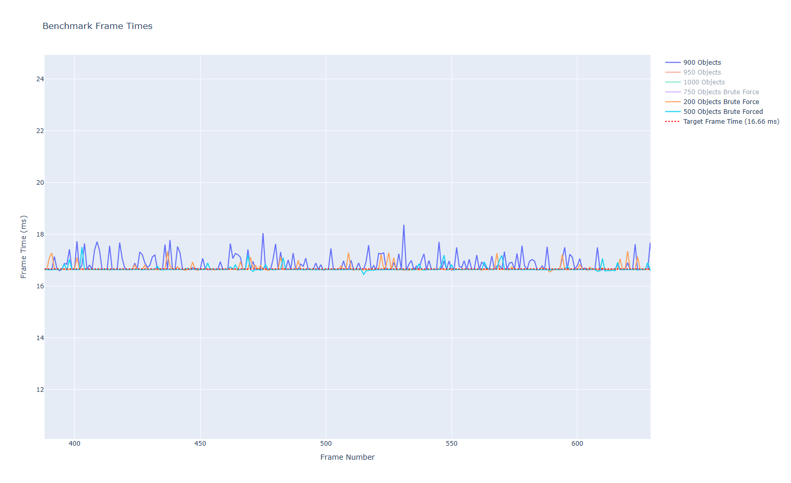
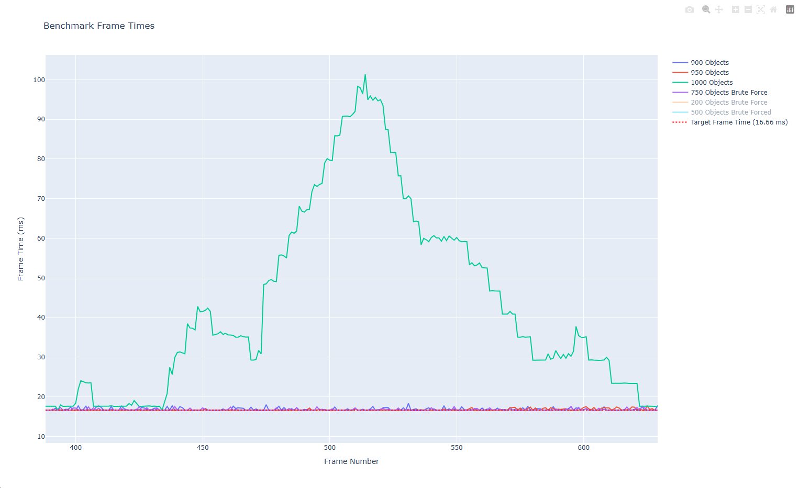

# 2d-physics-engine
A simple (in progress) physics engine built with raylib and C++, which I started over winter break. 

This August, I returned to this project to refactor it and scale it into a fully fledged simulator. I'm made a good amount of progress on the refactor so far; the engine has a stronger foundation, cleaner code, more practical OOP, etc. I've focused on keeping the code as lightweight, modular, and simple as possible before I get into more complex physics logic.

### Currently: 

I'm planning out an impulse solver to improve on the currently brute forced collision algorithm. Before implementing the solver, I wanted to run some microbenchmarks to get a gauge of where exactly my brute force solution caps out. That way, when the engine code is optimized, there is a measureable improvement. I set up a few python scripts to generate environments of variable size to benchmark, and plot their performance differences. Brute forcing collision between objects in an environment will cap out steeply at around 1000 dynamic objects.

